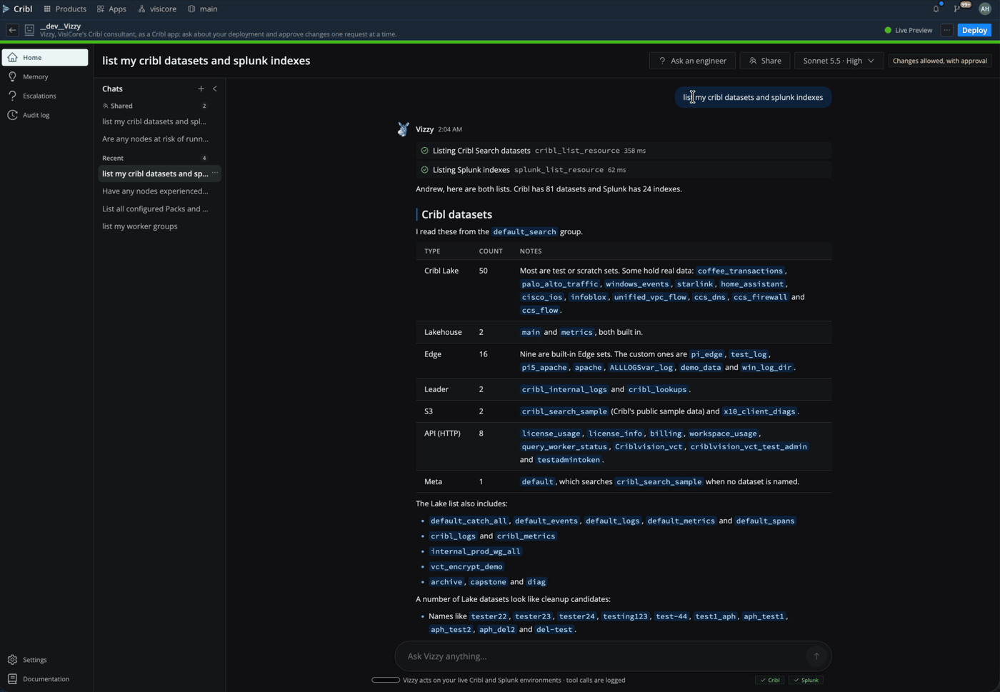
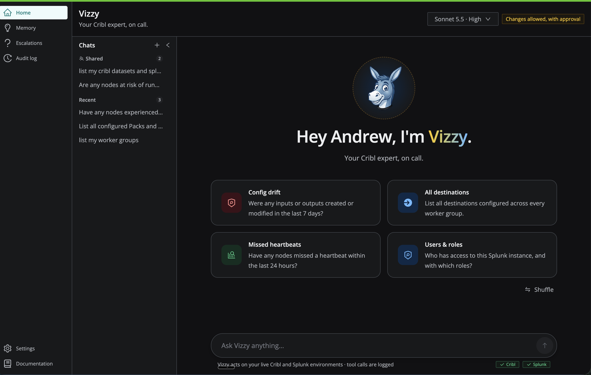
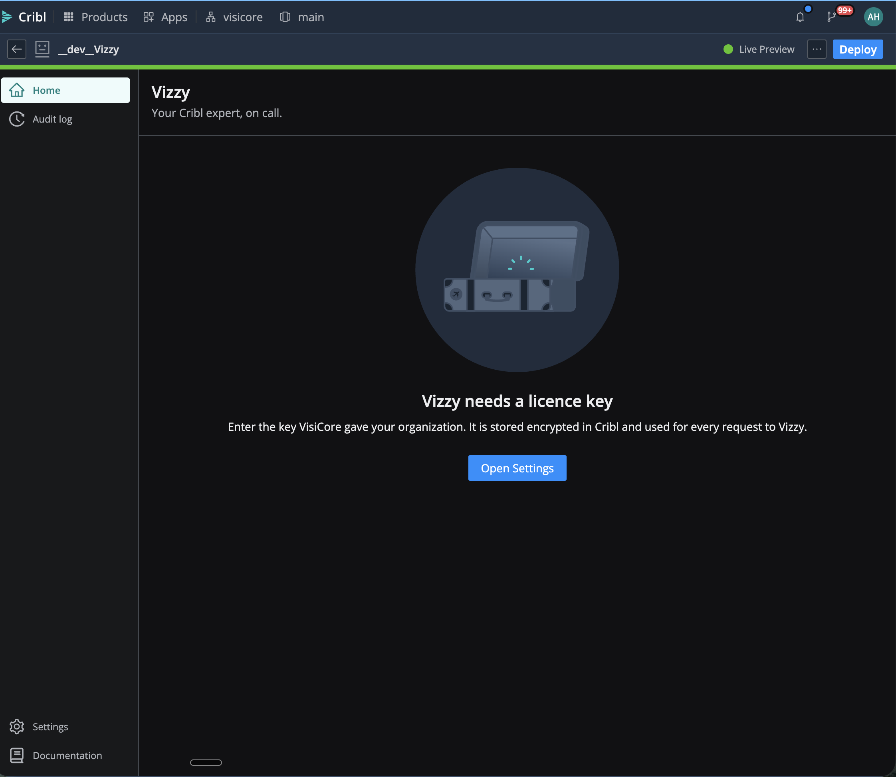
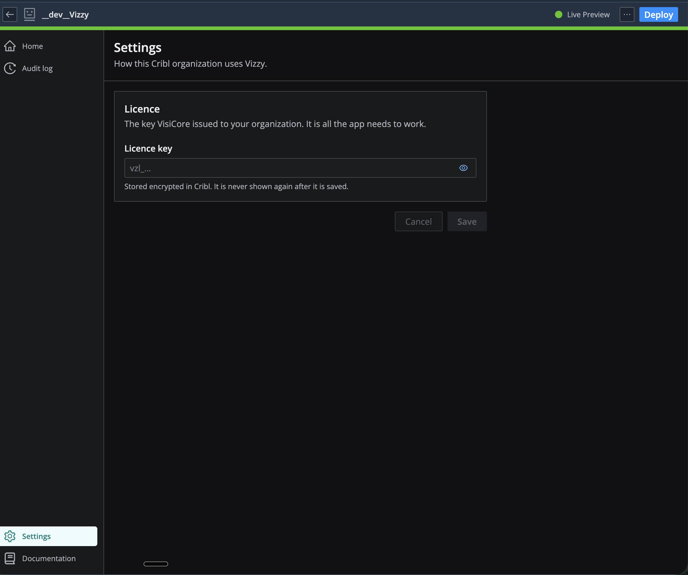

# Vizzy

Vizzy is VisiCore's Cribl consultant, inside your Cribl: ask it about your deployment in plain language, and let it make changes that you approve one request at a time.



*Vizzy lists Cribl datasets and Splunk indexes, then creates a Splunk index: it shows the exact request, waits for Approve, applies it, and reads the result back. The conversation is then shared with a coworker from the same Cribl organization, who joins it and picks up where it left off. Played at 1.5x.*

## Summary

Vizzy is a Cribl app for running and understanding a Cribl deployment by conversation. It helps users find out what is configured and how it is behaving, diagnose problems across worker groups and fleets, and make configuration changes with a person approving the exact request before anything is sent.

## What This App Does

* Primary purpose: an AI consultant that reads your live Cribl environment and, if you allow it, proposes changes for you to approve.
* Key capabilities:
  * Answers questions from live state: worker groups, fleets, nodes, sources, destinations, pipelines, routes, packs, version control, metrics, logs and Cribl Search.
  * Proposes changes as the exact API request, shown on an approval card. Nothing is sent to Cribl until you press Approve.
  * Shared conversations: bring a coworker from your Cribl organization into a chat, so two or more of you work with Vizzy together in one thread.
  * Follows VisiCore's guidance for Cribl work, and says which guidance a change follows.
  * Remembers your preferences and what it has learned about your environment, and can hand a conversation to a VisiCore engineer.
  * Keeps an audit log of every tool call that cannot be edited or deleted.
  * Draws diagrams of your environment with Cribl's own icons.
* Intended users:
  * Cribl admins and platform owners
  * Engineers who build and operate pipelines
* Works with:
  * Cribl.Cloud: Stream, Edge and Search

## When To Use This App

* You want a quick, accurate picture of a deployment: what is connected to what, what is disabled, what is undeployed.
* Something looks wrong and you want the errors, backpressure and node health gathered and explained.
* You want a change made the VisiCore way, with the request in front of you before it is applied.
* You want a second person in the room: one of you asks for a change and a coworker reviews and approves it, in the same conversation.

## Use Cases

What Vizzy does that the assistants built into Cribl and Splunk do not: it works across both in one conversation, it carries out the change instead of describing it, and it brings VisiCore's standards and people with it.

| Ask | Why it is different |
|---|---|
| Data from the firewall source stopped showing up in Splunk an hour ago. Trace it from the Cribl source to the Splunk index and tell me where it stops. | One investigation across both products: source, route, pipeline, destination health, then the index. No switching tools, no copying IDs between them. |
| I need a new HEC input in Splunk for the web app's index and a Cribl destination that sends to it. | Vizzy makes both changes, in order. Each is shown as the exact request and waits for Approve. The token Splunk returns goes into the Cribl destination without appearing in the chat or the audit log. |
| Which Cribl destinations send to Splunk, and does every index they write to exist in Splunk? | A question neither product can answer alone, because each only knows its own half. |
| This is beyond what we can fix. Get a VisiCore engineer. | A person, not a dead end: Vizzy writes the handoff, and a VisiCore engineer reads the conversation and replies in it. |
| Onboard our Palo Alto firewall logs end to end: a syslog source in Cribl, parsing, a route, and a Splunk index sized for 30 GB a day with one year of retention. | A whole onboarding done the VisiCore way, not one object at a time. Vizzy reads VisiCore's onboarding and index standards, lays out the plan across both products, and names the guidance each step follows. Every change is its own approval, commit and deploy included, and it verifies each one before moving to the next. |

Behind all of them: Vizzy remembers what it has learned about your environment from one conversation to the next, and every call it makes is kept in an audit log that cannot be edited.

Splunk prompts need VisiCore to have connected your Splunk. Changes need "Allow changes, with approval" switched on.

## Before You Install

* Required Cribl product or deployment type: Cribl.Cloud.
* Required permissions or roles: Vizzy acts with the signed-in person's own Cribl permissions. It can see and change only what that person can.
* Required external systems or APIs: the Vizzy server run by VisiCore. The app does not work without it.
* Required configuration values: a licence key from VisiCore.
* Known limits or prerequisites: the browser tab has to stay open while Vizzy works, because the tab makes the Cribl API calls.

## Installation

### Install From Marketplace or URL
1. Go to Apps in your Cribl environment.
2. Choose the Marketplace or import from URL option.
3. Install Vizzy, review the API paths and the external host it uses, and complete installation.
4. Share the app with the people who should use it.

### If The App Is Not Yet In The Cribl Marketplace
1. Get the `.tgz` package for the version you want from VisiCore.
2. In Cribl, go to Apps and choose import from file.
3. Upload the package, review the app details and complete installation.

## Configuration

| Setting | Required | Description | Example | Scope |
|---|---|---|---|---|
| Licence key | Yes | The key VisiCore issued to your organization. Stored encrypted in Cribl and never shown again. | `vzl_…` | shared |
| Allow changes, with approval | No | Whether Vizzy may propose changes at all. Off by default. Each change still needs its own approval. | Off | shared |
| Anthropic key | No | Your organization's own Anthropic API key. With it, Anthropic bills your account and you can choose the model. Without it, conversations run on VisiCore's managed credits. | `sk-ant-…` | shared |
| Model | No | The default Claude model for new conversations. Available only with your own Anthropic key. | Sonnet 5.5 | shared |

Settings apply to everyone the app is shared with, and anyone the app is shared with can change them.

## How To Use

### Typical Workflow
1. Open Vizzy from the Apps page.
2. In Settings, enter the licence key and press Test connection.
3. On Home, ask a question or pick one of the suggested ones.
4. When Vizzy proposes a change, read the request on the card and Approve or Reject it.
5. Review what was done in the Audit log.

### Working Together In One Conversation

A conversation can be shared with coworkers in your Cribl organization, so several people and Vizzy work in the same thread.

1. Open a conversation and press **Share**.
2. Pick a coworker under "Add a colleague". The list comes from your Cribl organization's own members, so they do not need to have opened Vizzy before.
3. The conversation appears under **Shared** in their chat list. They see everything in it, including what came before, and can ask Vizzy in it themselves.

How it behaves:

* Everyone follows the same conversation live: each person's messages carry their name, and Vizzy knows who is asking.
* Vizzy acts with the Cribl permissions of whoever asked. A coworker with less access gets less; nobody borrows anyone else's.
* Any participant who may approve changes can approve one. The change is then sent with the approver's Cribl permissions, and the audit log records who asked and who approved.
* One question at a time: while Vizzy is answering one person, the others wait for it to finish.
* The owner can add and remove people or hand the conversation over; anyone else can leave.

### First Run, In Pictures



Until a licence key is entered, every page says so and points to Settings.



In Settings, paste the key VisiCore issued to your organization and save. The key is stored encrypted in Cribl and is never shown again.



Then ask a question on Home, or pick one of the suggested ones.

### First-Run Checklist
* Enter the licence key.
* Decide whether to allow changes.
* Ask "What worker groups and fleets do I have?" to confirm Vizzy can read your environment.

## Permissions

Vizzy's Cribl API calls are made by the signed-in person's browser, so they are limited twice: by the paths this app declares, and by that person's own Cribl role. If Cribl refuses a call, Vizzy reports that the person lacks the permission and carries on with what it can reach.

A request that changes anything is sent only after the person presses Approve on a card showing that same request.

### Cribl API Endpoints Used

| Method | Endpoint | Purpose |
|---|---|---|
| GET | `/api/v1/health` | Leader health |
| GET, POST, PATCH, DELETE | `/api/v1/system/*` | Version, settings, licences, logs, metrics queries; users, roles and other global resources (changes need approval) |
| GET | `/api/v1/master/groups`, `/api/v1/master/workers` | Worker groups, fleets and their nodes |
| PATCH | `/api/v1/master/groups/*` | Deploying a group (needs approval) |
| GET, POST, PATCH, DELETE | `/api/v1/m/{group}/*` | Sources, destinations, pipelines, routes, packs, libraries, version control and search jobs in a group (changes need approval) |
| GET, POST | `/api/v1/w/{node}/*` | A node's logs and metrics; files and processes on Edge nodes |
| GET | `/api/v1/products/{stream,edge,search}/users` | The organization's members, for sharing a conversation |
| GET, POST, PATCH, DELETE | `/api/v1/products/lake/lakes/*` | Lake datasets and storage locations (changes need approval) |
| GET, POST, PATCH, DELETE | `/api/v1/notification-targets`, `/api/v1/workspaces` | Notification targets and workspaces (changes need approval) |
| PUT | `/api/v1/kvstore/vizzy_licence_key` | Storing the licence key, encrypted |

## External API Access

### Default Configuration
* `default/proxies.yml`: the Vizzy server's host, limited to paths under `/api/`, with the licence key added from the app's encrypted KV store.
* `default/policies.yml`: the Cribl API paths listed above.

### External Endpoints
* The Vizzy server (VisiCore): runs the model, holds VisiCore's guidance, and stores conversations and the audit log. It receives your questions, the results of the Cribl API calls Vizzy makes, and the name and email of the signed-in person.

The app calls no other external service. Calls to Claude are made by the Vizzy server.

## Data And Storage

* KV keys used by the app: `vizzy_licence_key` (encrypted). Nothing else is stored in Cribl.
* Conversations, settings and the audit log are stored on the Vizzy server, per organization. A conversation is visible only to the person who started it.
* Secrets in tool results and in change requests are removed before the model or the audit log sees them.
* Uninstalling the app removes the licence key from Cribl. Data on the Vizzy server is kept until you ask VisiCore to remove it.

## Support

### Partner Built
This app is built by VisiCore. VisiCore owns support, maintenance and feature requests for it. Cribl does not provide support for app-specific behavior. Contact your VisiCore team.

## Known Limitations

* The browser tab must stay open while Vizzy works; closing it fails the step in progress.
* In a shared conversation, an approved change is sent by the approver's browser, so the approver's tab has to be open when they approve.
* A coworker you add can take up to a minute to see the conversation appear in their list.
* Billing and credit usage are not available to Vizzy from inside the app.
* Splunk is available only when VisiCore has connected it for your organization. It is reached from the Vizzy server with that one connection, not with each person's own Splunk sign-in.
* Vizzy cannot install or manage other Cribl apps.

## Troubleshooting

### The App Opens But Some Features Do Not Work
* "Vizzy needs a licence key": enter the key in Settings.
* Vizzy says a call was refused: your Cribl role does not allow it.
* Vizzy says it cannot make changes: "Allow changes, with approval" is off in Settings.

### The App Cannot Connect To An API Or Service
* Press Test connection in Settings. If it fails, the licence key may have been revoked or the Vizzy server may be unreachable from your Cribl.

## Development

```bash
npm install
npm run dev       # Live Preview in Cribl
npm test          # unit tests
npm run lint
npm run package
```

The Vizzy server's hostname is fixed at packaging time in `config/proxies.yml` and `src/config.ts`; the two must match. See `AGENTS.md` for the platform contract.

## Project Layout

```text
src/
  App.tsx            navigation and routes
  config.ts          the Vizzy server's address
  lib/relay.ts       sends Vizzy's Cribl API calls from the browser; decides what may be sent
  lib/session.ts     one open conversation and its live event stream
  lib/server.ts      calls to the Vizzy server
  pages/             Chat, Audit, Settings, Docs
  components/        thread, approval card, composer
config/
  policies.yml       Cribl API access grants
  proxies.yml        the Vizzy server
README.md
```

## License

This app is proprietary to VisiCore. See [LICENSE](./LICENSE). Using it requires a Vizzy licence key from VisiCore.

## App Metadata

| Field | Value |
|---|---|
| App Name | Vizzy |
| App ID | cc-visicore-vizzy |
| Version | 0.1.0 |
| Author | VisiCore |
| Support Model | partner-built |
| Support Label | Partner Built |
| Support Contact | Your VisiCore team |
| License | Proprietary. See LICENSE |
| License File | [LICENSE](./LICENSE) |
| Product Tags | stream, edge, search |
| Category | AI assistant |
| Audience | admin, platform-owner, builder |
| Availability | preview |
| Requires External Access | yes |
| Repository | https://github.com/VisiCore/cc-visicore-vizzy |
| README Schema Version | 1.0 |
